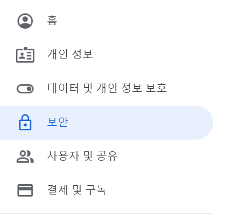
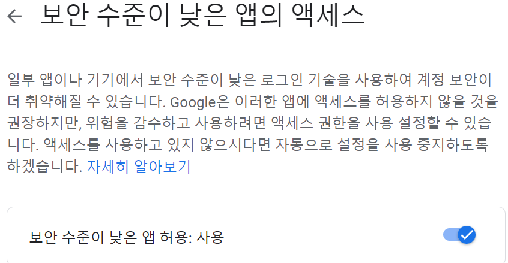
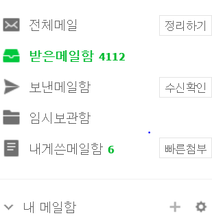
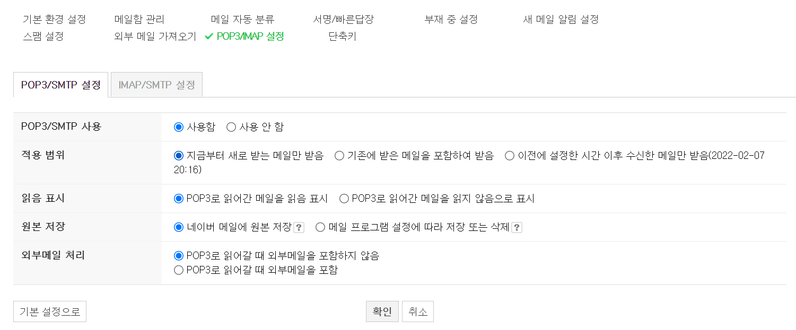

# Spring Boot 이메일 전송 SMTP

### SMTP 란?
SMTP는 Simple Mail Transfer Protocol로서 전자 메일 전송을 위한 표준 프로토콜 이다.

따라서 SMTP Server란 이메일을 송신하는 서버이다.

(메일서버는 SMTP Server, POP3 Server가 있고 POP3 Server은 이메일을 수신하는 서버이다.)

~~요즘 정보처기기사 필기 준비하는데 이렇게 보니 반갑다~~

## 0. 메일 계정 보안 설정

SMTP를 이용한 이메일 전송은 전송하고자 하는 메일에 대한 계정 보안 설정이 필요하다.

메일 계정 보안 설정은 자신이 사용하고 싶은 계정만 진행하면 된다.

### 0-1. Google

1. 이메일 전송을 할 Google 계정에 로그인 후 계정관리에 들어간다.
2. 보안 탭에 들어간다

   
3. '보안 수준이 낮은 엑세스'에 들어가 '보안 수준이 낮은 앱 허용'을 사용한다.


### 0-2. Naver
1. 이메일 전송을 할 Naver 계정에 로그인 한다.
   
2. 네이버 메일에 접속 후 아래의 '내 메일함'의 톱니바퀴 모양을 클릭한다.



3. 이 후 아래의 그림과 같이 설정한다.

   

   
위의 과정으로 각 계정에 대한 보안 설정은 끝이다.

## 1. Gardle 의존성 추가

```

implementation 'org.springframework.boot:spring-boot-starter-mail'	/* SMTP 이메일 수신 */
	
```

## 2. application.property 설정

Google 설정

```properties

# 메일 SMTP 프로퍼티  Google
spring.mail.host=smtp.gmail.com
spring.mail.port=587    #SMTP 서버 포트
spring.mail.username=사용할 계정 아이디@gmail.com
spring.mail.password=사용할 계정 비밀번호
spring.mail.properties.mail.smtp.starttls.enable=true   # StartTLS 활성화 여부 (기본값 : false)
spring.mail.properties.mail.smtp.auth=true  # 사용자 인증 시도 여부 (기본값 : false)

```

Naver 설정

```properties


# 메일 SMTP 프로퍼티 Naver
spring.mail.host=smtp.naver.com
spring.mail.port=465    #SMTP 서버 포트
spring.mail.username=사용할 계정 아이디@naver.com
spring.mail.password=사용할 계정 비밀번호
spring.mail.properties.mail.smtp.starttls.enable=true   # StartTLS 활성화 여부 (기본값 : false)
spring.mail.properties.mail.smtp.auth=true  # 사용자 인증 시도 여부 (기본값 : false)


```

각 메일 마다 Port 번호가 다른것으로 알고 있다.

이점 유의해서 사용하면 될 것 같다.


## 3. 코드 구현

사용할 Controller에 JavaMailSender를 Autowired해준다.

```java

@Autowired
private JavaMailSender mailSender;

```
그 이후 아래와 같이 코드를 작성하면 된다.

```java

@RequestMapping(value = "/mailTest", method = RequestMethod.GET)
public void mailTest(String email){

        Random random = new Random();
        int checkNum = random.nextInt(888888) + 111111;
        
        /* 이메일 보내기 */
        String setFrom="메일 전송에 사용할 이메일";    /* ex) googleMail@gmail.com */
        String toMail=email;    /* 메일을 받을 이메일 아이디   ex) naverMail@naver.com */
        String title="회원가입 인증 이메일 입니다.";
        String content=
        "홈페이지를 방문해주셔서 감사합니다."+
        "<br></br>"+
        "인증 번호는 "+checkNum+" 입니다."+
        "<br>"+
        "해당 인증번호를 인증번호 확인란에 기입하여 주세요.";

        try {
        MimeMessage message = mailSender.createMimeMessage();
        MimeMessageHelper helper = new MimeMessageHelper(message, true, "UTF-8");
        helper.setFrom(setFrom);
        helper.setTo(email);
        helper.setSubject(title);
        helper.setText(content, true);
        mailSender.send(message);

        } catch (Exception e) {
        e.printStackTrace();
        }
        
    }

```

## 4. 성공 확인


### Success!!

다른 기능, 파일첨부 등은 밑의 참고 블로그 혹은 다른 글을 찾아서 하시길 바랍니다.


[참고 블로그1](https://kimvampa.tistory.com/92?category=800652)

[참고 블로그2](https://javacoding.tistory.com/148)